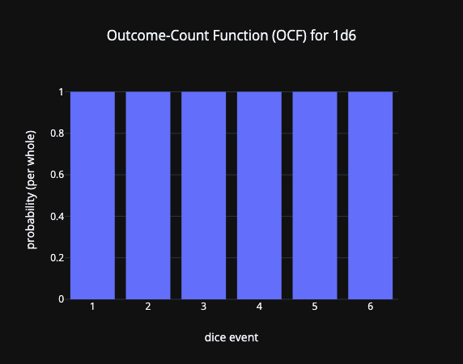
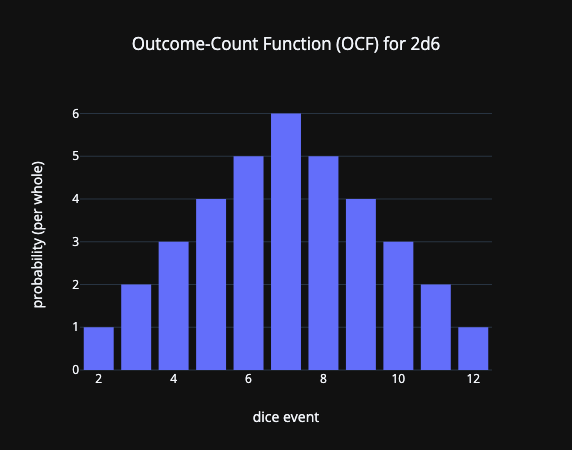
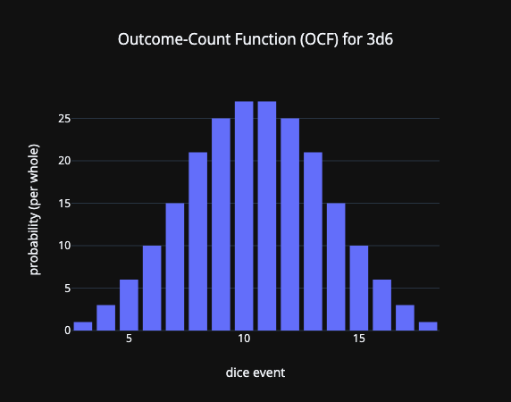
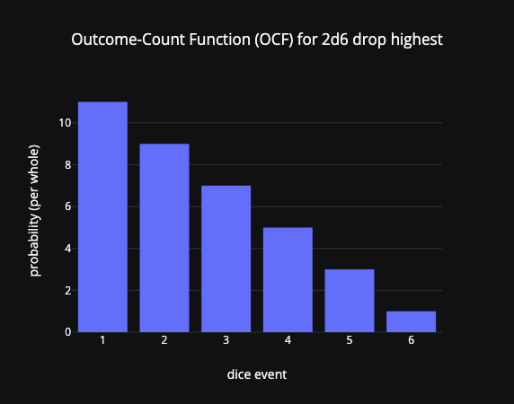
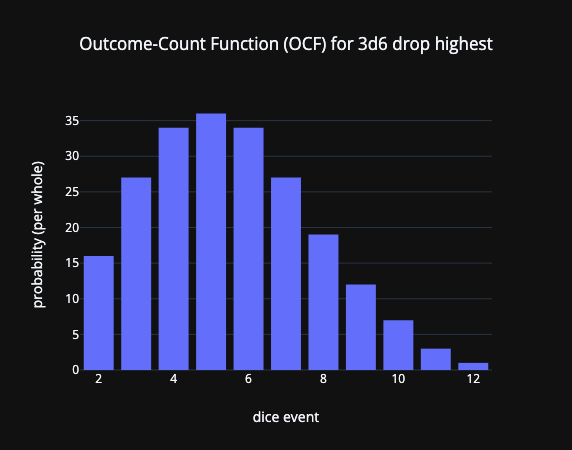

> Is God willing to prevent evil, but not able? Then he is not omnipotent.
> 
> Is he able, but not willing? Then he is malevolent.
> 
> Is he both able and willing? Then whence cometh evil?
> 
> Is he neither able nor willing? Then why call him God?
> 
> ― Epicurus

So I'm rolling stats for a lv. 1 warlock character. Right off the bat I didn't like this; I've played enough Fire Emblem to know that randomly-assigned stats are just a vehicle for demise. But this is what DM decreed, so I did what I was told and rolled for stats.

The scheme that DM implemented for stat rolling was this:

- choose a *specific* stat (one of STR, DEX, CON, INT, WIS, CHA)
- roll `4d6`, drop the lowest -> that's the value for that chosen stat
- do that for each stat once -> all of those assigned values form a *stat group*
- do ^ that whole process again to make a second stat group
- choose one of the stat groups to be your stats

I rolled the following two stat groups:

| STR | DEX   | CON   | INT | WIS | CHA |
|-----|-------|-------|-----|-----|-----|
| 17  | **5** | 14    | 14  | 15  | 9   |
| 12  | 15    | **5** | 15  | 10  | 15  |

Both stat groups had a 5. DM said "oof, that's pretty unlucky. sorry dawg." Choosing the second group gave my warlock a decent CHA so that spells would be effective, but the 5 CON meant that at lv. 1 the character had 5 HP. That means 10 damage would be an instant perma-death.

Obviously this was not super lucky.

...but *how* unlucky is this, exactly? 🧐

In the last post I talked about the coding side of building a D&D dice probability calculator / visualization tool. In this post I want to dip into the (imo easier) math behind calculating these distributions.

# some setup

Before getting into the math, I want to make sure readers understand some fundamental background about probability and statistics.

- an [*experiment*](https://en.wikipedia.org/wiki/Experiment_(probability_theory)) is a real-world process, that can be repeated, that has a well-defined set of [*outcomes*](https://en.wikipedia.org/wiki/Outcome_(probability)). E.g., rolling a `d6` is an experiment, and the outcomes are the numbers 1, 2, 3, 4, 5, and 6.
- an [*event*](https://en.wikipedia.org/wiki/Event_(probability_theory)) is a collection of outcomes. E.g., rolling an even number on a `d6` is an event, which is a collection of the outcomes \({2, 4, 6}\).
- a [*probability distribution*](https://en.wikipedia.org/wiki/Probability_distribution) (or in the case of dice rolls specifically, a [*probability mass function (PMF)*](https://en.wikipedia.org/wiki/Probability_mass_function)) is a mathematical function that takes as input a possible outcome / event, and outputs how probable it is for that result to be realized.

  For example, if a coin had a 55% change to land on heads when flipped (and a 45% of the same for tails), the PMF \(f\) would be defined as:
  $$
  \begin{array}{l}
    f(\text{heads}) := 0.55 \\
    f(\text{tails}) := 0.45 \\
    f(\text{anything else}) := 0 \\
  \end{array}
  $$
- [convolution](https://en.wikipedia.org/wiki/Convolution) is a mathematical operation that takes as input two N-dimensional arrays of numbers, and as output generates a third N-dimensional array. In this case, we'll use 1D-convolution to [calculate the distribution for the sum of two experiments](https://en.wikipedia.org/wiki/Convolution_of_probability_distributions) (e.g., `2d6` = `1d6` + `1d6`).

## implementing convolution

I mentioned in the last post that I was implementing this visualization tool in Python. One of the upsides of doing so is being able to use NumPy, which has a builtin convolution function, [`np.convolve`](https://numpy.org/doc/stable/reference/generated/numpy.convolve.html).

The caveat here is that `np.convolve` doesn't calculate the index shifting that occurs when convolving pure mathematical functions. Because `np.convolve` operates on arrays which don't store this offset data, I had to write this mathematical property in myself. My solution was to write a Python class that bundles array data and offset data, includes a `convolve` method that calculates both of these together, and includes a `consolidate` method that behaves like function addition (truncated below):

```python
from dataclasses import dataclass

import numpy as np

@dataclass(slots=True, kw_only=True)
class SequenceWithOffset:
    seq: np.array
    offset: int

    def convolve(self, other: SequenceWithOffset) -> SequenceWithOffset:
        if len(self.seq) == 0 or len(other.seq) == 0:
            # make a zero-length array with the correct dtype
            seq = self.seq[:0] + other.seq[:0]
        else:
            seq = np.convolve(self.seq, other.seq)
        return SequenceWithOffset(seq=seq, offset=self.offset + other.offset)

    def consolidate(self, other: SequenceWithOffset) -> SequenceWithOffset:
        if len(self.seq) == 0:
            return other.copy()
        elif len(other.seq) == 0:
            return self.copy()
        index_low = min(self.offset, other.offset)
        index_high = max(
            self.offset + len(self.seq),
            other.offset + len(other.seq),
        )

        seq = np.zeros(
            index_high - index_low,
            dtype=(self.seq[:0] + other.seq[:0]).dtype,
        )
        seq[
            self.offset - index_low : self.offset + len(self.seq) - index_low
        ] = self.seq
        seq[
            other.offset - index_low : other.offset + len(other.seq) - index_low
        ] += other.seq

        return SequenceWithOffset(seq=seq, offset=index_low)
```

Re: runtime complexity - unfortunately the docs aren't super clear, so I'm left to either read the source code (this is for fun I don't wanna read source code 😭), or guess. [Some research](https://fse.studenttheses.ub.rug.nl/25184/1/bCS_2021_GhidirimschiN.pdf.pdf) (and [some more](https://wangwei1237.github.io/shares/Algorithms_for_Efficient_Computation_of_Convolution.pdf)) makes guessing a little easier:

- A naive algorithm would run in \(O(n_1 n_2)\) time.
- The [Karatsuba algorithm](https://en.wikipedia.org/wiki/Karatsuba_algorithm) runs in \(O(n^{1.58})\) time, and doesn't seem to have other obvious implementation constraints.
- There are other algorithms with better asymptotic performance (e.g. [Toom-Cook 3 @ \(O(n^{1.46})\)](https://en.wikipedia.org/wiki/Toom–Cook_multiplication)), but they also have large coefficients that might be impractical for typical NumPy users / use cases.
- There's also [a NumPy implementation for a method of convolution that utilizes FFT's](https://docs.scipy.org/doc/scipy-1.14.1/reference/generated/scipy.signal.fftconvolve.html) which runs in \(O(n\log n)\) time, but since that only works on floating-point data I elected not to use it.
    - It seems like there's an analogous method of doing the FFT-enabled convolution for integers in the same \(O(n log(n))\) time, but instead using [the Number-theoretic Transform (NTT)](https://en.wikipedia.org/wiki/Discrete_Fourier_transform_over_a_ring#Number-theoretic_transform).
        - However, I am under the impression that NumPy devs didn't implement this integer-specific algorithm for convolution. Mainly because the corresponding floating-point specific algorithm using the FFT has its own function, and if they *had* implemented an integer-specific NTT, I imagine it would get its own function too. And I don't see one in the docs.
        - Also, from the paper cited above it seems like there are a number of complications required in the implementation to make it feasible. And it's unclear to me whether the NumPy developers would develop a complicated special-case algorithm just for integers, which I imagine is a pretty niche use case since you can just cast ints to floats.

-> Moving forward I'll assume a conservative \(O(n^2)\) time complexity for this function, but know that this may not be the true complexity depending on implementation specifics.

## probabilities vs. outcomes

One small change in perspective I want to implement here: instead of thinking in terms of probability distributions, I instead want to think in terms of *outcome-count distributions*.

So for example, let's consider the `2d6` case. There are \(6 \times 6 = 36\) different possible *outcomes*. The *events* we want to consider are the possible sums of dice values resulting from any of these 36 different outcomes; for `2d6` there are \(11\) such different events, which include all the integers from \(2\) (realized by rolling two \(1\)'s) to \(12\) (realized by rolling two \(6\)'s). I'll refer to these event values as *scores*, or *score values*.

Now let's say we're interested in how we might roll the score value \(5\). There are 4 outcomes that result in a \(5\): \({(1, 4), (2, 3), (3, 2), (4, 1)}\).

- in terms of *probability*, there is a \(\frac{4}{36}\) chance of rolling a \(5\) (assuming fair dice).
- in terms of *outcome counts*, there are 4 outcomes that result in a roll of \(5\): \({(1, 4), (2, 3), (3, 2), (4, 1)}\) are those outcomes.
- as long as the dice are fair, then one can convert between the two using the equation:
  $$
  (\text{probability that value} = x) = \frac{(\text{# of outcomes where value} = x)}{(\text{total # of outcomes})}
  $$

So when calculating probability distributions, I want to **first calculate an outcome-count function (OCF), and then convert that into a probability mass function (PMF) using the above equation on each event value**.

There are a handful of advantages to doing this:

1. Intermediate computations are all performed on integers instead of floating-point numbers. This means
    - there's no rounding errors that can accumulate through the computation,
    - each computer-stored number can store more information (64-bit floating-point numbers only [have 53 bits of storage for digits](https://en.wikipedia.org/wiki/Double-precision_floating-point_format#IEEE_754_double-precision_binary_floating-point_format:_binary64) -> I would get more precision with a 64-bit integer), and
    - any resulting values that are too large to store will generally trigger [a hardware-implemented error flag](https://en.wikipedia.org/wiki/Integer_overflow#Flags) that [is easier to respond to](https://doc.rust-lang.org/std/primitive.i64.html#method.checked_add).
1. It allows us to make some simple correctness checks. Specifically, rolling \(k\) \(n\)-sided dice always yields \(n^k\) outcomes, so any outcome-count distribution generated from rolling \(k\) \(n\)-sided dice must sum to \(n^k\) too. And if it doesn't, then the calculation must be wrong in some way.
1. It makes recursive calculations simpler. I'll discuss what I mean by this later on.

The downside is that it can't be used to represent unfair dice, but I'm not concerned with unfair dice here, so that drawback is moot.

## rolling `0dn`

This is effectively the distribution for when we roll "0 dice". While this isn't practical in the real world, mathematically this gets used a lot in the upcoming calculations for recursive or iterative definitions and algorithms, so it makes sense to define it here upfront.

The rationale is that rolling "0 dice" yields a single outcome \(()\), where the score value is the sum of "all the individual values", of which there are none, so this sum is \(0\).

Implementing this in Python might look like this:

```python
def roll_0dn() -> SequenceWithOffset:
    return SequenceWithOffset(seq=np.ones(1, dtype=np.uint64), offset=0)
```

... and the time complexity for generating this trivial data is constant time, \(O(1)\).

# calculations

And now, finally, some math 😈

For each of the cases below, I want to figure out:

1. a method for computing the experiment's OCF (which can be then turned into a PMF), written in Python, and
1. the time complexity for that computation method, in [big-O notation](https://en.wikipedia.org/wiki/Big_O_notation).

## rolling `1dn`

By definition, rolling one die with \(n\) sides will produce the OCF:

$$
f(x) = \begin{cases}
1 & \text{if } x \in [1, n] \\
0 & \text{otherwise} 
\end{cases}
$$

which could be implemented in Python in linear time \(O(n)\) like so:

```python
def roll_1dn(n: int) -> SequenceWithOffset:
    return SequenceWithOffset(seq=np.ones(n, dtype=np.uint64), offset=1)
```

Visualized, the plot for e.g. `1d6` looks like this:



Not super exciting, but definitions aren't really supposed to be.

## rolling `kdn`

For multiple dice, we can use the convolution operation mentioned above. Specifically, we can compose the OCF for `kdn` by convolving together the OCF of `1dn` with itself `k` times.

A simple Python function for calculating `kdn` might look like this:

```python
def roll_kdn(k: int, n: int) -> SequenceWithOffset:
    _1dn = roll_1dn(n)
    result = roll_0dn()

    for _ in range(k):
        result = result.convolve(_1dn)

    return result
```

The time complexity for this algorithm depends on how long each convolution takes, which depends on the lengths of the intermediate resulting arrays:
- the length of the original array is \(n\)
- the length of each array convolved with itself \(i\) times is \(i(n-1) + 1\)
- the time complexity for convolving a length-\(n\) array with a length-\((i-1)(n-1) + 1\) array is \(O(i n^2)\)
- the time complexity for calculating all auto-convolutions is:
  $$
  \begin{array}{l}
  O(\sum_i^k i n^2) \\
  = O(n^2 \sum_i^k i) \\
  = O(k^2 n^2) \\
  \end{array}
  $$

Below are some examples of what this looks like for a couple different \(k\) values:





And again, to convert this OCF to a PMF we need to know the total number of outcomes possible. Since there are \(k\) dice involved and each die has \(n\) outcomes of its own, the number of total outcomes is the product of those individual totals, \(n^k\).

### ❌ fewer convolutions doesn't actually make it faster

A more sophisticated algorithm can leverage the binary representation of `k` to perform fewer convolutions. Specifically, the previous algorithm computed `1dn` auto-convolved `k` times, which required \(k-1\) convolutions. Instead, we can compute auto-convolutions of `1dn` for all powers of two up to `k`, then convolve the subset of those results whose powers of two sum to `k`. This involves only \(\log_2(k)\) convolutions to compute the auto-convolutions, and another at most \(\log_2(k)\) convolutions to get the final result.

*(Ftr I didn't invent this myself; I've seen this trick used for other types of numerical calculations in other contexts.)*

Such an algorithm in Python might look like this:

```python
import numpy as np

def roll_kdn(k: int, n: int) -> SequenceWithOffset:
    # Calculate auto-convolutions at powers of two
    auto_convs = [roll_1dn(n)]
    for _ in range(1, k.bit_length()):
        prev = auto_convs[-1]
        auto_convs.append(prev.convolve(prev))

    # Calculate result from auto-convolutions
    result = roll_0dn()
    for i, auto_conv in enumerate(k.bit_length):
        ith_bit = k & (1 << i)
        if ith_bit == 0:
            continue
        result = result.convolve(auto_conv)

    return result
```

Re: time complexity of this algorithm:
- the length of each auto-convolution array, for a given number of convolutions \(2^i \leq k\), is:
  $$
  \begin{array}{l}
  2^i \cdot (n-1) + 1 \\
  = O(kn)
  \end{array}
  $$
- calculating the auto-convolutions takes time:
  $$
  \begin{array}{l}
  O \left( \sum_i (2^i n)^2 \right) \\
  = O \left(n^2 \sum_i 4^i \right) \\
  = O \left(n^2 k^2 \left(1 + \frac14 + \frac1{16} + ...\right)\right) \\
  = O(n^2 k^2)
  \end{array}
  $$
- the cumulative result after the \(k\)th step is (at most) the first \(k\) auto-convolutions convolved together.
- the length of the cumulative result array after the \(j\)th step, where \(2^j \leq k\), is (at most) the sum of the lengths minus \(1\) for each convolution operation:
  $$
  \begin{array}{l}
  \left( \sum_{i \leq j} 2^i \cdot (n-1) \right) + 1 \\
  = (n-1) \sum_{i \leq j} 2^i + 1 \\
  = (n-1) (2^{j+1} - 1) + 1 \\
  = O(nk)
  \end{array}
  $$
- calculating all cumulative results, and thus the final result, takes time:
  $$
  \begin{array}{l}
  O \left( \sum_j (kn)^2 \right) \\
  = O \left(k^2 n^2 \left(1 + \frac14 + \frac1{16} + ...\right)\right) \\
  = O(k^2 n^2)
  \end{array}
  $$

This happens to have the same complexity as the simpler algorithm above, even though this algorithm uses fewer convolution operations.

## rolling `kdn drop highest`

Ahhhh. Finally. We get to the content that made me want to do this in the first place ☺️

To calculate this, I need to be able to map all of the outcomes to specific score events. But I can't just use the result that our previous function `roll_kdn` would generate, because not all of the outcomes in a specific `kdn` event will map to the same `kdn drop highest` event.

For example, if I'm calculating `2d6 drop highest`, it would be tempting to try to call `roll_kdn(k=2, n=6)`, and use those outcome counts to make the new outcome counts. But in `2d6`, e.g. both of the outcomes \((1, 4)\) and \((2, 3)\) would be in the \(5\) score event, but in `2d6 drop highest` they would both count towards different score events, specifically \(1\) and \(2\), respectively. And since I'm not storing the actual outcomes themselves, just the number of outcomes for each score event, how would one know how to reassign counts from `2d6` to `2d6 drop highest`?

So afaik, calculating `kdn drop highest` (and `drop lowest`) with convolutions only works by breaking the problem down into a bunch of smaller sub-problem distributions, calculating those OCF's, and element-wise summing all of the smaller OCF's together. The trick is how to come up with the sub-problems.

To make this a little more tangible, I'm going to work through a specific example.

### rolling `3d4 drop highest`

For our tangible example, let's specifically consider \(k=3\) and \(n=4\).

For our sub-problems, I want to individually consider the different events for how the largest dice value, e.g. \(4\), does or does not get rolled, and what score distributions correspond to those events. From those sub-distributions, I can re-map the scores to drop the highest value (i.e., \(4\)) and re-collect them into the final distribution.

Specifically, I want to separately consider the following partition of events:

1. all three dice roll a \(4\):
    - *(there is exactly one outcome for this event - \((4, 4, 4)\))*
    - one of the \(4\)'s gets dropped from the score
    - the other two \(4\)'s are kept in the score
    - -> the result is the single-event distribution `8`
1. exactly two of the dice (i.e., the first and second, the second and third, or the first and third) roll a \(4\), and the remaining one die rolls a lower number between \(1\) and \(3\):
    - one of the \(4\)'s gets dropped from the score
    - one of the \(4\)'s is kept in the score
    - the other remaining die kept in the score rolls less than a \(4\), so it is effectively a `d3` 
    - -> the distribution is effectively that of `1d3 + 4`
1. exactly one die (i.e., the first, second, or third) rolled a \(4\), and the others rolled any other lower number between \(1\) and \(3\):
    - the \(4\) gets dropped from the score
    - the remaining die roll less than \(4\), so they are both effectively `d3`'s
    - -> the scored result is effectively `2d3`
1. the remaining possibilities (which doesn't quite fit the prompt) is that *none* of the dice are \(4\)'s
    - all dice roll less than \(4\), so they are effectively each a `d3`
    - no dice has been designated to be dropped
    - -> this is effectively the same as `3d3 drop highest`

Note that the 1-die and 2-dice cases each have three unique orderings, while the 0-die and 3-dice cases each have one ordering. More generally, the number of orderings for a given number of fixed high dice \(i\) is [\(k\)-choose-\(i\)](https://en.wikipedia.org/wiki/Binomial_coefficient), or \(k \choose i\).

Altogether, if we write the OCF of a distribution \(d\) as \(f_d\), then we can recursively express the OCF of `3d4 drop highest` as follows:

$$
\begin{align}
f_{3d4 \text{ drop highest}} (x)
&= {3 \choose 0} f_{8} (x) \\
    &+ {3 \choose 1} f_{1d3 + 4} (x) \\
    &+ {3 \choose 2} f_{2d3} (x) \\
    &+ {3 \choose 3} f_{3d3 \text{ drop highest}} (x)
\end{align}
$$

### back to the general case, `kdn drop highest`

For the general case of dropping the highest die (specifically for the non-trivial cases, i.e. when there is more than one die \(k > 1\), and the die has multiple outcomes \(n > 1\)), we can formulate an equation similar to the `3d4 drop highest` case:

$$
f_{kdn \text{ drop highest}} (x) \\
= {k \choose k} f_{kd(n-1) \text{ drop highest}} (x) \\
    + \sum_{i \in [0, k-1]} {k \choose i} f_{id(n-1) + n \cdot (k-1 -i)}
$$

However, since this is a recursive definition, we have to define the end conditions, of which there happen to be two:
- when \(k = 1\) - if we roll one die and drop "the highest" (a.k.a. "the only"), it's the same as rolling no dice: 
$$
f_{1dn \text{ drop highest}} (x) \\
= f_{0} (x) \\
= \begin{cases}
    1 & \text{if } x = 0 \\
    0 & \text{otherwise} \\
\end{cases}
$$
- and when \(n = 1\) - if all dice can only roll a \(1\), then rolling \(k\) dice and dropping "the highest" should always result in the same value, i.e. \(k-1\):
$$
f_{kd1 \text{ drop highest}} (x) \\
= f_{k-1} (x) \\
= \begin{cases}
    1 & \text{if } x = k-1 \\
    0 & \text{otherwise} \\
\end{cases}
$$

In both end cases, the OCF reduces to \(f_{k-1}\).

With the equation established, we can now implement it in Python:

```python
import math

def roll_kdn_drop_highest(k: int, n: int):
    if k == 1 or n == 1:
        return SequenceWithOffset(seq=np.ones(1, dtype=np.uint64), offset=k-1)

    result = roll_kdn_drop_highest(k=k, n=n-1)
    for i in range(k):
        sub_result = roll_kdn(k=i, n=n-1)
        sub_result.seq *= math.comb(k, i)
        sub_result.offset += n * (k - 1 - i)
        result = result.consolidate(sub_result)
    return result
```

Some graphs of this are shown below:






Like the function itself, the complexity can also be expressed recursively. The non-recursive parts are:
- the base case at `kd1` or `1dn`, which are constant time: \(O(1)\)
- a loop from \(i=0\) to \(k-1\): \(O( \sum_{i=0}^{k-1} ... )\):
    - calculating `kdn`: \(O(i^2 n^2)\)
    - element-wise multiplication for \(i(n-1) + 1\) elements: \(O(in)\)
    - `consolidate`, i.e. initialization and element-wise addition for at most \(k(n-1) + 1\) elements: \(O(kn)\)

Let \(O(C(k, n))\) be the time complexity of this algorithm. Then altogether the complexity would be expressed as follows:

$$
\begin{align}
O(C(k, n)) :&= O\left( C(k, n-1) + \sum_{i=1}^{k-1} (i^2 n^2 + \cancel{in} + \cancel{kn}) \right) \\
    &= O\left( C(k, n-1) + n^2 \sum_{i=1}^{k-1} i^2 \right) \\
    &= O\left( C(k, n-1) + n^2 k^3 \right) \\
    \textit{apply def. of } C(k, n-1) \rightarrow &= O\left( \left( C(k, n-2) + k^3 {(n-1)}^2 \right) + k^3 n^2 \right) \\
    \textit{repeatedly apply def. of } C(k, n-j) \rightarrow &= O\left( ... + k^3 {(n-2)}^2 + k^3 {(n-1)}^2 + k^3 n^2 \right) \\
    &= O\left( k^3 \sum_{j=1}^n {(n-j)}^2 \right) \\
    &= O\left( k^3 n^3 \right) \\
\end{align}
$$

### calculate all sub-distributions in advance -> better performance & complexity

In #kdn, we showed that it takes just as much time complexity to calculate an OCF for `kdn`, as it does to calculate all OCF's of `idn` for \(i \in [1, k]\). Doing the latter explicitly in this function is significant enough that it actually improves the overall time complexity.

The revised Python code might look like this:

```python
def iter_autoconv(dist: SequenceWithOffset):
    result = roll_0dn()
    while True:
        yield result
        result = result.convolve(dist)

def roll_kdn_drop_highest(k: int, n: int):
    if k == 1 or n == 1:
        return SequenceWithOffset(seq=np.ones(1, dtype=np.uint64), offset=k-1)

    result = roll_kdn_drop_highest(k=k, n=n-1)
    for i, kdnm1 in zip(range(k), iter_autoconv(roll_1dn(n-1))):
        sub_result = kdnm1.copy()  # reallocates a new object & numpy array
        sub_result.seq *= math.comb(k, i)
        sub_result.offset += n * (k - 1 - i)
        result = result.consolidate(sub_result)
    return result
```

... for which the new time complexity would look like this:

$$
\begin{align}
O(C(k, n)) :&= O\left( C(k, n-1) + k^2 n^2 + \sum_{i=1}^{k-1} (in) \right) \\
    &= O\left( C(k, n-1) + k^2 n^2 + n \sum_{i=1}^{k-1} i \right) \\
    &= O\left( C(k, n-1) + k^2 n^2 + \cancel{k^2 n} \right) \\
    \textit{repeatedly apply def. of } C(k, n-j) \rightarrow &= O\left( ... + k^2 {(n-2)}^2 + k^2 {(n-1)}^2 + k^2 n^2 \right) \\
    &= O\left( k^2 \sum_{j=1}^n {(n-j)}^2 \right) \\
    &= O\left( k^2 n^3 \right) \\
\end{align}
$$

So explicitly calculating the auto-convolutions of `1d(n-1)` reduces the time complexity from \(O(k^3 n^3)\) to \(O(k^2 n^3)\), which is a reduction by a factor of \(k\).

### note re: outcome counts vs. probabilities

So when I said "[using outcome counts] makes recursive calculations simpler", this is what I meant.

Specifically, I wouldn't be able to use the nested recursive `kdnm1` calculations as sub-functions to calculate `roll_kdn_drop_highest`, unless I either 1) first converted each probability distribution to an outcome-count distribution before doing any aggregation, or 2) tried to use them as conditional probabilities. Doing both of these things would be annoyingly complicated.

*(In fact, when I was first writing this code I started out using probability distributions with workaround 1), and when I got to doing the "drop highest/lowest die" functions I ran into bugs that I couldn't figure out how to fix. For me in this case, it turned out to be easier to refactor everything into using outcome counts and rewriting the function s.t. the bugs were obviated, rather than fixing whatever bugs I had.)*

## rolling `kdn drop high m`

The above can be further generalized to dropping the \(m\) highest dice from the score.

TODO - but right now, I am very tired. I'll write about this... later.

### caching calculated sub-distribution

TODO

## rolling "..." and dropping the *lowest* dice

While we could repurpose the thinking and problem formulation used before for the "drop highest \(m\) dice" case in order to solve the "drop lowest \(m\) dice" case, there is a simpler solution:

- reverse the distribution array of the input *(technically needed for general calculations, but not needed specifically for dice roll distributions)*
- calculate `roll_kdn_drop_high(k, d, m)`
- reverse the distribution array

And we would get the correct result! But why? It's because there's actually a lot of symmetry in this calculation that we can take advantage of.

So imagine if we took the *negative inversion* of our distribution (i.e., \(f_{1d(-n)}(x) = f_{1dn}(-x)\)), where all outcomes instead are comprised of negative numbers (i.e., `2d(-6)` has outcomes like \((-3, -5)\)). It's easy enough to map outcomes & events from `1d(-n)` to `1dn` and vice versa.

Now if we used this inverted distribution to do the same calculation of dropping the "highest" values, it would instead drop the highest *negative* values in `kd(-n)`, which would correspond to the *lowest* values in `kdn`.

In this way, we can reuse `roll_kdn_drop_high(k, d, m)` to calculate `roll_kdn_drop_low(k, d, m)`, without having to reformulate the previous algorithm at all:

```python
def roll_kdn_drop_low(k: int, d: int, m: int):
    result = roll_kdn_drop_high(k, d, m)
    result.seq = result.seq[::-1]
    return result
```

This also takes advantage of some simplifications for the case of dropping highs/lows from `kdn` specifically:
- since `1dn` always has a symmetric distribution, it doesn't have to be reversed in the first step.
- the offset doesn't have to change since the range of valid score events (i.e., the offset and the array length) is the same for `kdn drop high m` and `kdn drop low m`.

## refactors for working with generic distributions

After writing Python functions like the ones described in the prior sections, I realized that they could be made even more generic. Specifically, the functions that calculated distributions for repeated rolls (i.e., `roll_kdn`, `roll_kdn_drop_lowest`, etc.) didn't actually rely on any specific features of dice-roll distributions; in fact, they could be reworked to accept a generic distribution parameter and operate directly on that with few changes to the original algorithm.

For example, `roll_kdn` was refactored into `roll_k`:

```python
def roll_k(dist: SequenceWithOffset, k: int) -> SequenceWithOffset:
    result = roll_0dn()
    for _ in range(k):
        result = result.convolve(dist)
    return result
```

TODO - for more specifics, check out [the real source code](https://github.com/CrepeGoat/heart-of-the-dice/blob/v0.1.1/dice/calc.py).

These modifications mean that we can calculate arbitrary nestings of repeated distributions with dropped high or low values. For example, calculating the distribution for the sum of rolled stats could be done by running:

```python
roll_k(roll_k_drop_lowest(roll_1dn(n=6), k=4, drop=1), k=6)
```

which wouldn't have been possible to calculate with the pre-factored code.

And with the above change, the calculation functions are effectively feature-complete to calculate any probability result I could want.

# hath god forsaken me?

After writing out this math & code, I opened up a Python interpreter, loaded in the code, and started running some numbers:

```pyconsole
>>> from dice import calc as dc
>>> import numpy as np
```

- what are the odds of getting the stat sums that I got for my two stat groups?
  ```pyconsole
  >>> sum([17, 5, 14, 14, 15, 9])
  74
  >>> sum([12, 15, 5, 15, 10, 15])
  72
  >>>
  >>> stat_sum = dc.roll_k(dc.roll_k_droplow(dc.roll_1dn(6), k=4, drop=1), k=6)
  >>> stat_cdist = np.add.accumulate(stat_sum.seq)
  >>>
  >>> stat_cdist[74 - stat_sum.offset] / stat_cdist[-1]
  np.float64(0.5507508601943684)
  >>> stat_cdist[72 - stat_sum.offset] / stat_cdist[-1]
  np.float64(0.4377304041567714)
  ```
  -> these are the 55th and 43rd percentiles; both percentiles are within 10% of the median, the center of the distribution, which is quite close. Not lucky, not unlucky.

- what are the chances of rolling a \(5\) or lower for a single stat?
  ```pyconsole
  >>> dc.roll_k_droplow(dc.roll_1dn(6), 4, 1)
  SequenceWithOffset(seq=array([  1,   4,  10,  21,  38,  62,  91, 122, 148, 167, 172, 160, 131,
          94,  54,  21], dtype=uint64), offset=3)
  >>> (1 + 4 + 10) / (6 ** 4)
  0.011574074074074073
  ```
  -> ~1.16%, or about \(\frac{5}{432}\) *(note that this event has \(1 + 4 + 10 = 15\) outcomes; this is less likely than rolling the highest number, an 18, which has \(21\) outcomes.)*
- what are the chances of rolling a \(5\) or lower for *any* of the six stats in a stat group?
  ```pycon
  >>> p = 15 / (6 ** 4)
  >>> 1 - (1 - p) ** 6
  0.06746579772408667
  ```
  -> ~6.75%, about \(\frac{5}{74}\)
- what are the chances of rolling a \(5\) or lower *in both stat groups*?
  ```pycon
  >>> p_g = 1 - (1 - p) ** 6
  >>> p_g ** 2
  0.004551633862547378
  ```
  **-> ~0.455%**, about \(\frac{1}{219}\)
- how unlucky is that compared to rolling a 1 with advantage?
  ```pycon
  >>> d20_adv = dc.roll_k_droplow(dc.roll_1dn(20), k=2, drop=1)
  >>> d20_adv.seq / (20 ** 2)
  array([0.0025, 0.0075, 0.0125, 0.0175, 0.0225, 0.0275, 0.0325, 0.0375,
         0.0425, 0.0475, 0.0525, 0.0575, 0.0625, 0.0675, 0.0725, 0.0775,
         0.0825, 0.0875, 0.0925, 0.0975])
  ```
  -> rolling a 5 for both stat blocks is not as bad as crit-failing with advantage (0.25%, \(\frac{1}{400}\)), but is worse than rolling a 2 with advantage (0.75%, \(\frac{3}{400}\)), which is pretty bad.

...god dammit.
