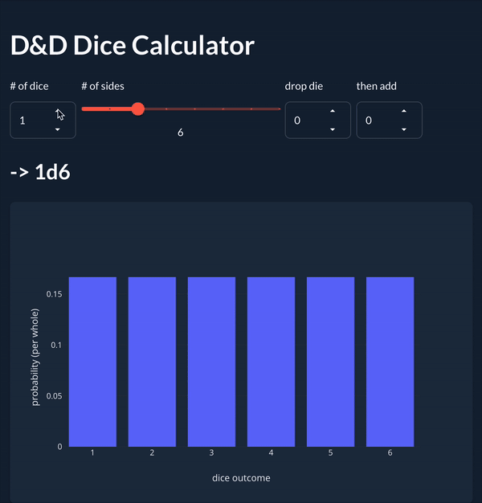

# tl;dr: the result



- hosted app: https://crepegoat.pythonanywhere.com/
- code (as of writing): https://github.com/CrepeGoat/heart-of-the-dice/tree/v0.1.1

# motivation

About a year ago I started playing D&D in a campaign that my work friend is running. He's a brilliant creative and comedic mind that has written a lot of interesting scenarios, but at the same time is a goofy lil' goober that gives us space to have fun without taking his world too seriously; all-around he's a great DM and getting to play with him and other mutual friends has been a weekly highlight for me. Since then I've joined a second campaign with a separate friend group, and have been binging content from Dimension 20 (which btw is HI-larious).

This all to say: I've been consuming a lot of D&D content recently.

In doing so I've found myself thinking about dice-rolling probabilities. E.g., if you roll with advantage you have a better chance of rolling high numbers, but *how much* better are your odds, exactly? What about rolling `4d6` and dropping the lowest die, like you do when rolling for your character stats; what's a "good" stat role, statistically speaking? Not only did I want answers to these questions, but I was also curious about the math for the sake of the math: how could this be calculated?

Questions in mind and free-time in hand, I decided to just make a software visualization tool to do these calculations and visualize the results.

# goals & design choices

At the outset, I wanted to make a tool that fit the following qualities:

1. **I can put it together quickly** - I personally struggle with a project when I spent most of my time doing boring or confusing boilerplate work, instead of doing the interesting work that motivated me in the first place. I don't want that to be a problem here.
2. **It is easily accessible** - I want it to be able to use it easily, share it with others, and not force myself & others to install anything to use it.
3. **The functionality should be specific to D&D** - There is adjacent probability/statistics-style functions that I could add to this tool, but I want this to be for D&D players specifically; if a feature doesn't have a direct D&D use, it shouldn't be in the tool.
4. **(bonus) The functionality should allow for fairly arbitrary calculations** - There are some niche calculations in which users may be interested for good reason (e.g., prob. distr. for sum of rolled stats = `(4d6 drop low) x 6`, rolling with disadvantage and blessed with a +3 modifier = `(2d20 drop high) + 1d4 + 3`, etc.). An ideal tool would allow for calculating probabilities for these niche situations, but in the beginning handling just the basic cases is sufficient.
5. **(bonus) It should be pretty minimalist**
    - This is desirable to me in part because of the project itself, but also in part because of my own philosophical yearning for simplicity.
    - Re: the project itself: this tool should calculate probabilities of discrete events with individual outcomes (i.e., sides on a die) ranging *in the tens*. Not millions, not billions. *Tens*. I don't want to make some data center burn extra CPU cycles, money, electricity and cooling water, just because I misused resources through making poor technological or algorithmic choices.

With these qualities in mind, I considered a handful of different options, summarized in the table below:

| 1  | 2  | 3 | 4 | 5 | technology / design                                     | chosen? |
| -- | -- | - | - | - | ------------------------------------------------------- | :-------: |
|    | ❌  |   |   |   | a desktop/CLI app                                       |         |
| ⚠️ | ⚠️ |   |   |   | a mobile app                                            |         |
| ❌  |    |   |   |   | anything with JS                                        |         |
| ⚠️ |    |   |   | ✅ | a WASM-based web framework                              |         |
| ✅  |    |   |   | ❌ | Streamlit                                               |         |
| ✅  |    |   |   | ❌ | **-> Taipy**                                                   |     ✅   |
| ✅  | ✅  | ✅ | ❌ |   | **-> make a couple buttons for rolling one kind of die**       |    ✅    |
| ❌  | ⚠️ | ⚠️ | ✅ |   | make a full calculator-esk interface for arbitrary equations |         |

In words:

- desktop vs. mobile vs. web app
  - a desktop/CLI tool would be too limiting to be readily accessible to e.g. my peers (and tbh myself, I don't want to use a keyboard-only tool).
  - a mobile app would mostly work, but distribution via app stores would get a little complicated.
  - a web tool sounds great! anyone with a web browser can use it, I can just send a link to someone and say "hey check it out", there's (generally) no platform issues. It just works.
- JS vs. WASM vs. other
  - I'm not great with web technologies like JS/HTML/CSS, and right now I don't want to have to be.
  - I could learn a WASM-based web framework, which would probably make an extremely performant web page. However the WASM plotting ecosystem [seems immature atm](https://www.reddit.com/r/rust/comments/17u96w1/comment/k92hagf/?utm_source=share&utm_medium=web3x&utm_name=web3xcss&utm_term=1&utm_content=share_button), and I don't want to struggle to get simple plots working.
  - I'm probably most familiar with Python of all languages / ecosystems (especially NumPy/Pandas, which is great for the data vector number-crunching that I anticipated doing), so a Python-based web framework would get me going pretty quickly.
- Python frameworks
  - I know of two simple Python-based web frameworks: Streamlit and Taipy. Both of these have support for mainstream plotting libraries like Plotly, with which I'm pretty familiar.
  - I've used Streamlit before, and got a bit confused because it's [an immediate-mode GUI](https://github.com/emilk/egui/tree/83a30064f4812d0029532675a5f2bf38c257ad0e?tab=readme-ov-file#why-immediate-mode) (which, ftr, the docs do not try very hard to explain imo). Taipy claims to be better, may as well give it a shot.
- UI interface
  - I *want* to make a calculator-styled interface with arbitrary editable equations s.t. you can calculate arbitrary probabilities, but I'd get way more value much more quickly by making it simple and iterating with this cool feature later. Also, making a calculator-styled interface might make it too complicated for it's own good.
  - making just a couple controls for many rolls of a single type of die (`Kd4`, `Kd6`, etc.) is much simpler to implement.

**-> we're using Taipy / Python to make a one-die-type calculator**

# Taipy

Getting a Taipy MVP app up-and-running was fairly straight-forward; I had a couple minor hiccups with getting some particular design stuff to work, but otherwise it mostly did what I needed it to do. Note that I opted to not change any of the styles in favor of getting something working, especially considering that the default styles look pretty fine.

## ❌ making multiple sets of die controls -> give up & move on

A desirable quality for this tool is to be able to represent more complicated probability calculations, like rolled stat sums (`(4d6 drop low) x 6`) or rolling with bless (`1d20 + 1d4`). While the former requires a full arbitrary expression UI which I decided was a bad idea for the time being, the latter is just a sum of heterogeneous dice rolls. This could be implemented by having a dynamic list of individual homogeneous dice controls (e.g., inputs for die side counts, die counts, and drop counts).


This implementation felt like a good idea because it expanded the set of possible operations to include very common use cases (e.g., roll with bless), without making the interface overly complex from either a user or coder standpoint. It seemed like the best of both worlds.

However, I couldn't figure out a way to do this cleanly. Taipy has what feels like a magic syntax for making control elements bind to state variables, and putting those control elements in a list seemed to break this magic.

After ~1/2-1 day I gave up and just decided to make the simple version with one set of dice controls. It wouldn't be able to handle the "roll w/ bless" case, but it would handle lots of other common cases, and doing so got me to an MVP faster.

## ✅ import issues in Python -> just make a `setup.py` & install

It's been a while since I've used Python. I've forgotten a lot of the rituals I used to use to get a project off the ground, and why I needed them in the first place.

For example, if you want a project that comprises multiple files, with imports between them, that can be run both as a command-line program and also run in tests, you can achieve this in two ways:

1. use `sys.path` to constantly add files to your import path (which is extremely messy), or
2. make a `setup.py` file that bundles your code into a package.
- you also need to put empty `__init__.py` files in every folder, for... reasons.

And if you do neither of these things or forget the `__init__.py`'s, all of your imports fail.

Having forgotten this, I started out with neither, just importing stuff relatively and not writing tests. It was a bad time.

So yeah. Python's kind of awful about imports.

I tried to do some research into what the canonical solution was for this problem; I had heard that more modern tools like `poetry` had a lot of advantages over the vanilla `setup.py`. I gave it a shot, but I didn't find a clear guide on getting started with it. (Likely I was mostly frustrated with the import issues and wasn't ready to commit time to learning about this new thing with dubious advantages.)

So anyway, after finding an example from an old project to use as a template, struggling a bit with getting the `find_packages` function to do what I wanted, and twiddling the folder paths in it until I got lucky, eventually I ended up writing [this `setup.py` file](https://github.com/CrepeGoat/heart-of-the-dice/blob/v0.1.1/setup.py) and everything worked out fine.

# hosting

Now that I had a Taipy app working locally, I needed to find a way to host it.

## 😓 lesson: Taipy doesn't build static websites (hindsigh)

What I didn't realize when I chose Taipy (again: web is not my strong suit) is that **Taipy doesn't generate static websites**.

(For others like me from two weeks ago who also don't know: websites can be either static or dynamic. The difference in my mind is how it behaves after loading: a static website doesn't need anything else from the server, and can continue running without further server communication; a dynamic website needs to continue to fetch other content from the server as users interact with the already-loaded webpage.)

Learning this actually gives me a much better understanding of how Taipy (and probably Streamlit) work. Specifically, if Taipy/Streamlit *did* generate static websites, then they would need some way to run Python in your browser. This is a bit bizarre, because a browser is a program that is designed specifically to understand & run JavaScript (and more recently WASM), and nothing else. To run Python, a theoretical Python-written static webpage would have to either:

1. translate Python into JS/WASM at build time, or
2. actually include a full Python interpreter compiled to JS/WASM in the site itself to run the author's Python code dynamically.

Considering that Taipy/Streamlit can run arbitrary Python code and arbitrary Python dependencies, including those with C extensions like NumPy, and knowing that CPython is a relatively large program to just include as a webpage dependency, both of these theoretical options feel... impractical.

Instead, knowing that Taipy/Streamlit generate *dynamic* web pages makes way more sense. Taipy doesn't magically put your Python code in the browser; the only thing in the browser is the framework-provided visual controls (the buttons, text, dropdowns, etc.) you specify. *Those* are translated from Python to JS/HTML, and everything else is run *on the server*, where it's relatively easy to run a Python interpreter.

## hosting Taipy on [pythonanywhere.com](https://www.pythonanywhere.com/) (PA)

The downside of this tool being a dynamic website is that hosting becomes more expensive. Most of the free options for hosting websites (Netlify, Github Pages, Firebase, Vercel, Render, etc.) are for hosting *static* websites.

The one exception I could find is [PythonAnywhere](https://www.pythonanywhere.com/) (PA); as long as your app's web server runs using Python, they'll host your site for you for free. (The free tier is missing a number of niceties, like custom domain names and more than 0.5GB of storage space. But it's free. [*So* free](https://www.penny-arcade.com/comic/2011/06/10/unbeatable-value). And it's enough to get me going.)

This was probably the most frustrating part of making the app. I was hoping that this would be such a common use case that I could just find a tutorial online and put it together pretty quickly. Unfortunately [the only tutorial I could find](https://levelup.gitconnected.com/how-to-host-your-taipy-app-on-pythonanywhere-82005a341810) was pay-walled behind medium.com and I didn't have an account. So for a while I was pretty lost.

I eventually scrapped together a couple bits of documentation, tutorials and stack overflow posts to get the information I needed. But it took some research and testing.

### ❌ learn about WSGI -> wild goose chase

The first search hit directed me to [this PA guide for hosting Django apps](https://help.pythonanywhere.com/pages/DeployExistingDjangoProject). One of the things that stood out in this guide is setting up the WSGI file.

...wait what's [WSGI](https://docs.python.org/3/library/wsgiref.html)?

I probably spent a couple hours reading about [what it is](https://peps.python.org/pep-0333/) and [how others use it](https://youtu.be/WqrCnVAkLIo?si=FtCHlP46cd6suH-S).

By the end of it, I learned that I didn't want to know what it was, and it looked like it was mostly a framework-level thing that at a framework-consumer-level I didn't have to understand. So I started looking for any other possible path to success.

### ❌ Taipy deployment instructions...? -> not especially helpful

I arrived at [Taipy's deployment instructions](https://docs.taipy.io/en/release-4.0/userman/run-deploy/) a couple times from different web searches, but none of the content here seemed to apply to whatever I had to do with PythonAnywhere's `..._wsgi.py` file that I read about before. This mostly just burned up my time. 

### ✅ deploy your Taipy app like a Flask app

Eventually I found [a StackOverflow post](https://stackoverflow.com/a/77178530/) that described how to access the underlying Flask app from within your Taipy app. And I realized that if that's possible, then I should just be able to follow [the Flask app deployment docs](https://help.pythonanywhere.com/pages/Flask/) to deploy this app.

...actually the Flask guide wasn't super helpful. I ended up just following the Django guide and reading the `..._wsgi.py` file comments on how to set up Flask apps.

But anyway with all of the above and the StackOverflow-described substitution, this was fairly straight-forward (aside from one hiccup, described below).

My resulting, working `/var/www/crepegoat_pythonanywhere_com_wsgi.py` file looks like this:

```python
# This file contains the WSGI configuration required to serve up your
# web application at http://CrepeGoat.pythonanywhere.com/
# It works by setting the variable 'application' to a WSGI handler of some
# description.

# ... lots of other comments here ...

# +++++++++++ FLASK +++++++++++
# Flask works like any other WSGI-compatible framework, we just need
# to import the application.

from dice.main import app_gui
app_gui.run(run_server=False)
application = app_gui.get_flask_app()

# NB -- many Flask guides suggest you use a file called run.py; that's
# not necessary on PythonAnywhere.  And you should make sure your code
# does *not* invoke the flask development server with app.run(), as it
# will prevent your wsgi file from working.
```

*(...huh... I remember this code being longer and more complicated... 🤔)*

### ✅ not enough disk space to install Taipy -> install it in pieces

The first step in the Django deployment instructions was to upload your code. So I cracked open their interactive bash terminal and did the ol' `git clone --depth=1 [MY_PROJECT]`. E-Z-P-Z-BAE-B 🤙

The second step in the Django deployment instructions was to [set up your virtualenv](https://help.pythonanywhere.com/pages/DeployExistingDjangoProject#create-a-virtualenv-and-install-django-and-any-other-requirements). So I cracked open their interactive bash terminal and did the ol' `python -m venv venv; source venv/bin/activate; pip install .`:

```sh
ERROR: Could not install packages due to an EnvironmentError: [Errno 28] No space left on device
```

*"...fuck."*

*"Oh god is it not even gonna fit? How much space do I have here?"* looked at the PA dev portal *"Half a GB?! Shit it might not even fit, Taipy's probably pretty beefy. Uhhhg god okay maybe I can clear out files and make space?"* Looked around, found [instructions to clear out your cache](https://help.pythonanywhere.com/pages/DiskQuota#cleaning-up-unused-files), tried again; same thing. *"FUCK."*

"...wait. [that one post about hosting Taipy apps on PA](https://levelup.gitconnected.com/how-to-host-your-taipy-app-on-pythonanywhere-82005a341810) might be pay-walled, but *it exists*. This *must* be possible."

I poked around my `venv` a bit more; I noticed that even though not all of the dependencies would fit, some of them *did* successfully install. So I kept rinsing (clearing the cache) and repeating (retrying the install), and eventually it worked.

It took struggling a bit to succeed though, so tl;dr: these are the highlights for getting everything to install:

- don't put your `venv` in your project folder. They literally give you a `/.virtualenvs/` folder in your file system root. Just use it.
- when running `pip install`, use [the `--no-cache-dir` flag](https://pip.pypa.io/en/stable/topics/caching/#disabling-caching) - this will stop `pip` from storing wheel files on disk. In fact, these wheels are exactly what the cache empty-ing instructions were deleting -> using `--no-cache-dir` means you don't have to clear your cache on every install iteration.
- install individual pieces one by one: for me, I installed `taipy-core`, `taipy-gui`, `taipy`, and then my project; in that order.

### loose odds and ends

Aside from editing the `..._wsgi.py` file and making the `venv`, there's a few other config things to do in the PA Web App dashboard (this might not be everything, I can't quite remember my exact process here):

- `Code > Source code` -> `/home/USERNAME/your/project/folder/`
- `Code > Working directory` -> `/home/USERNAME/your/project/folder/` (not sure what this does, tbh?)
- `Virtualenv` -> `/home/.virtualenvs/venv/` ...or wherever you put it. If you wanna be a lil' freak with your `venv`'s don't let *me* stop you 😏

# and the beast was done

And that's it! This process is more or less what it took for me to deploy my very first web app ever. At least, that's everything from the coding side; I also did a handful of math (yusss 🤩) to get this working, which I'll write about in another post.
